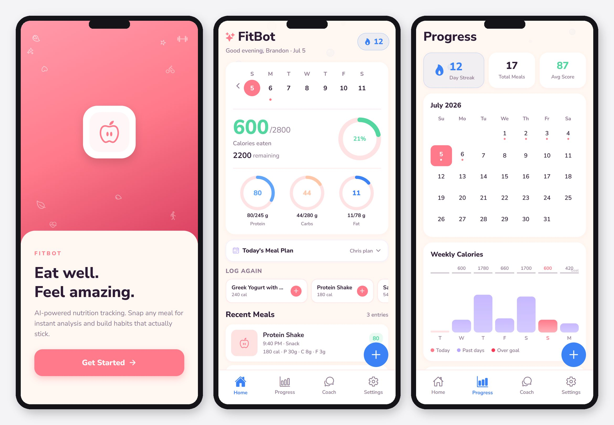
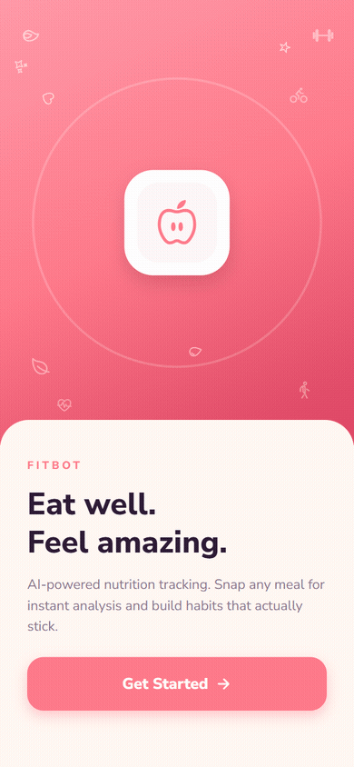

# FitBot: AI Food Tracker

**[Live Demo →](https://fit-bot-eight.vercel.app/)** — try it in your browser, no install needed.

A React Native / Expo mobile app that uses Claude's vision API to analyze meals from photos, track nutrition, and provide personalized health coaching.

## Screenshots



## Demo



Onboarding, home dashboard, and progress screens running on Expo Web. The [live demo](https://fit-bot-eight.vercel.app/) runs the full product, including real AI photo analysis and coaching, through a serverless proxy so no API key ships to the browser — upload a food photo instead of using the camera, since browsers can't access it the way a native app can.

## Features

- **AI meal analysis**: snap a photo of your food and get instant calorie, macro, and health score breakdowns powered by Claude Sonnet
- **Nutrition tracking**: log meals, track daily calories/protein/carbs/fat against personalized goals
- **Weight logging**: track weight over time with an interactive chart
- **Streak system**: daily logging streaks with milestone celebrations
- **Meal reminders**: configurable push notifications for breakfast, lunch, dinner, and evening check-ins
- **Body plan profiles**: fitness goals mapped to celebrity-inspired macro splits (Mifflin-St Jeor BMR + TDEE)
- **AI coach**: conversational nutrition advice chat powered by Claude
- **Animated themes**: six profile themes (Rose, Ocean, Confetti, Ember, Forest, Night Sky) with particle animations
- **Account system**: local email/password auth with profile picture support

## Tech Stack

| Layer | Choice |
|---|---|
| Framework | Expo SDK 54 / React Native 0.81 |
| Language | TypeScript (strict) |
| Navigation | `@react-navigation` (stack + bottom tabs) |
| Storage | `AsyncStorage` |
| AI | `@anthropic-ai/sdk`, `claude-sonnet-4-6` |
| Fonts | Nunito Sans via `expo-font` |
| Camera | `expo-camera` + `expo-image-manipulator` |
| Notifications | `expo-notifications` |

## Setup

**1. Install dependencies**
```bash
npm install
```

**2. Create `.env` at the project root**
```
EXPO_PUBLIC_ANTHROPIC_API_KEY=your_anthropic_api_key_here
```
Get a key at [console.anthropic.com](https://console.anthropic.com).

**3. Start the dev server**
```bash
npx expo start
```
Scan the QR code with Expo Go on your phone.

> **WSL2 users:** Your phone can't reach the WSL2 internal IP. Use `npx expo start --tunnel` or configure a `netsh portproxy` rule pointing the Windows host IP at port 8081.

## Project Structure

```
src/
  screens/       # HomeScreen, ProgressScreen, SettingsScreen, OnboardingScreen, ...
  services/      # storage.ts, claude.ts, notifications.ts, eventBus.ts, themeContext.tsx
  components/    # EditEntryModal, WeightLogModal, ThemeBackground, ...
  navigation/    # Stack + tab navigator
  types/         # Shared TypeScript types
  theme.ts       # Color (C.*) and font (F.*) constants
shims/           # Node.js built-in stubs for Metro bundler
```

## How the AI Analysis Works

1. Camera captures a photo → compressed + base64 encoded
2. Base64 image sent to `claude-sonnet-4-6` with a structured JSON prompt
3. Claude returns calories, macros, health score (0–100), meal type, and healthier alternatives
4. User can edit the result before saving to local storage

The system prompt is cached with `cache_control: { type: "ephemeral" }` to reduce API costs on repeat calls.

## Development Notes

- Run `npx tsc --noEmit` after every change. There is no lint or test script.
- `react-native-reanimated` is **not** installed; all animations use the built-in `Animated` API with `useNativeDriver: true`
- New `UserPreferences` fields can be added to `DEFAULT_PREFS` in `src/services/storage.ts` with no migration needed; reads shallow-merge with defaults

## Production Notes

The native app (Expo Go) reads `EXPO_PUBLIC_ANTHROPIC_API_KEY` directly, which embeds the key in that build. That's acceptable for personal/local use, not for distribution.

The [web deploy](https://fit-bot-eight.vercel.app/) does not do this: `src/services/claude.web.ts` calls Vercel serverless functions (`api/analyze.ts`, `api/chat.ts`) that hold the key server-side behind per-IP rate limiting, so the key never ships to the browser. Metro resolves `.web.ts` files automatically, so this split is enforced at the bundler level, not just by convention.

## License

MIT. See [LICENSE](LICENSE).
